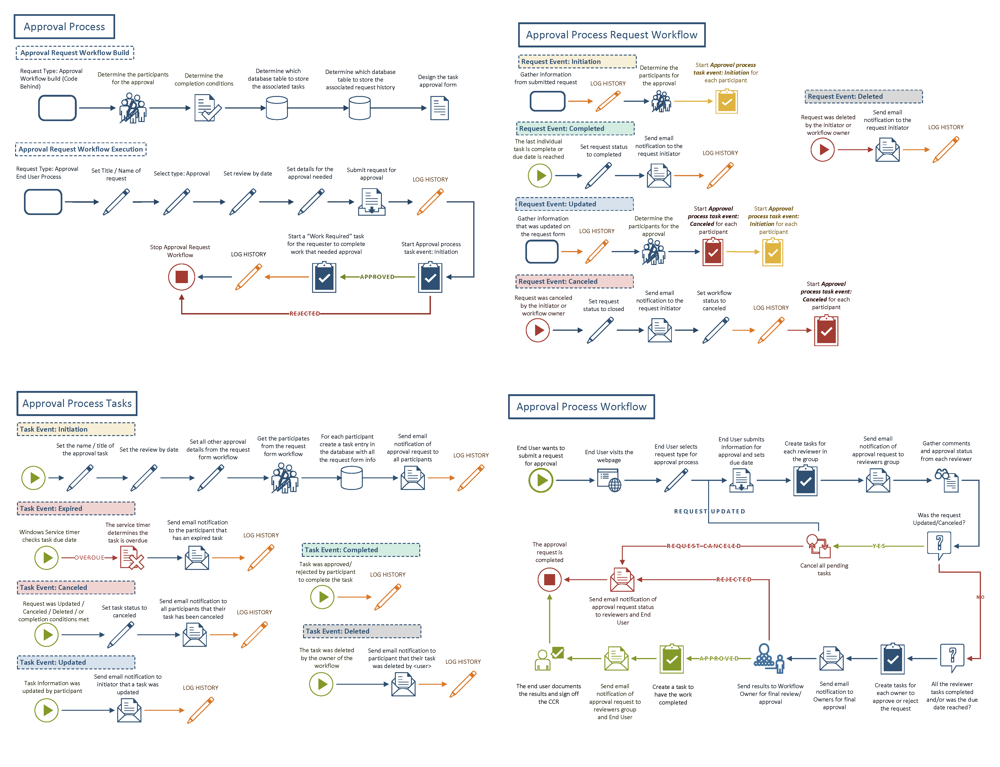
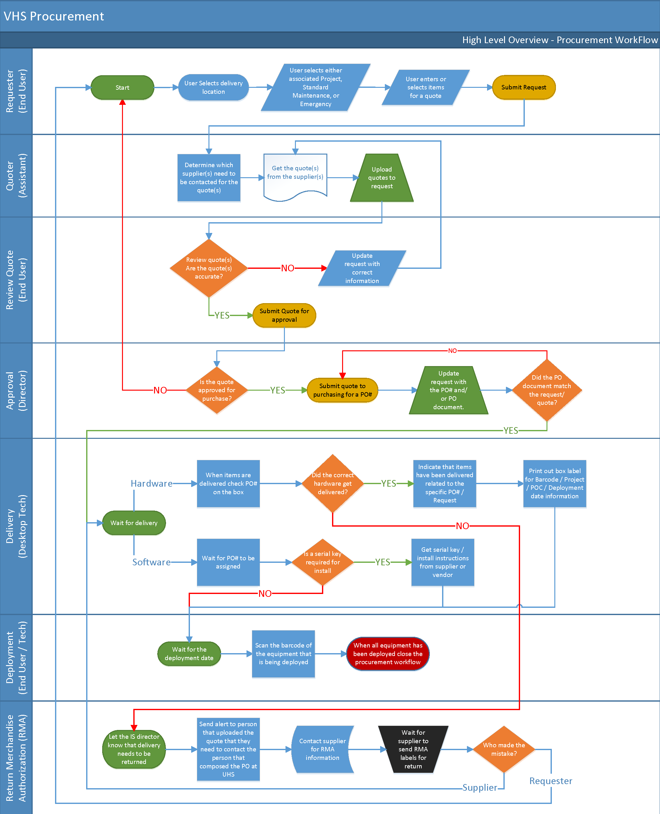
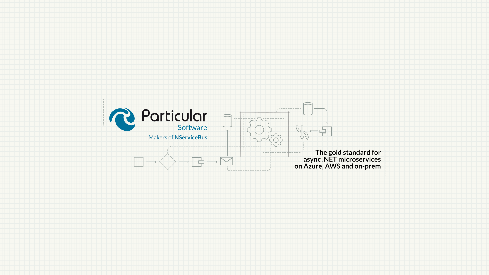

# Travis Nickels – Portfolio

Experienced software engineer and project manager with a focus on full-stack development, distributed systems, and internal automation. This portfolio showcases select projects demonstrating technical expertise, problem-solving, and collaboration across multiple domains.

## Internal Automation Tools

**Stack:** C#, Azure Functions, GitHub Actions, GraphQL, YAML, Slack  
**Challenge:** A lot of repetitive admin work (status update reminders, creating recurring issues, moving project board cards) ate up developer time and slowed teams down.  
**Result:** Freed up engineers to focus on real work, improved accountability, and cut down on missed updates.

**Key Contributions:**

- Automated recurring tasks like GitHub issue creation, project board updates, and Slack reminders.
- Built a status update reminder system that eliminated weekly manual checks across task forces.
- Created automated recurring platform enhancement issues to ensure continuous process coverage.

**Skills demonstrated:** Automation, workflow optimization, system integration, backend development

## Customer & Technical Support Enhancements

**Stack:** NServiceBus, RabbitMQ, Azure Service Bus, Amazon SQS, Vitest, Testing Library  
**Challenge:** Messaging and distributed system issues were tricky to diagnose and added overhead for both customers and developers.  
**Result:** Improved reliability, gave customers better guidance, and made support workflows more efficient.

**Key Contributions:**

- Resolved complex RabbitMQ transport issues by integrating Management API with NServiceBus.
  - [NServiceBus.RabbitMQ 10.0.0](https://github.com/Particular/NServiceBus.RabbitMQ/releases/tag/10.0.0) - (Release)
  - [RabbitMQ 4.0 support](https://github.com/Particular/NServiceBus.RabbitMQ/pull/1512) - (PR)
  - [ServiceControl 6.5.0](https://github.com/Particular/ServiceControl/releases/tag/6.5.0) - (Release)
  - [Update to NServiceBus.RabbitMQ 10.0.0 and use management client](https://github.com/Particular/ServiceControl/pull/4755) - (PR)
  - [RabbitMQ delivery limit check documentation and upgrade guide](https://github.com/Particular/docs.particular.net/pull/6960) - (PR)
  - [Changes for RabbitMQ transport v10 with ServiceControl](https://github.com/Particular/docs.particular.net/pull/7038) - (PR)
- Developed a BDD-focused testing DSL for frontend validation.
  - [ServicePulse 1.38.2](https://github.com/Particular/ServicePulse/releases/tag/1.38.2) - (Release)
  - [History period tests](https://github.com/Particular/ServicePulse/pull/1856) - (PR)
  - [Endpoint sorting tests](https://github.com/Particular/ServicePulse/pull/1815/) - (PR)
  - [Monitoring endpoint details test](https://github.com/Particular/ServicePulse/pull/1845) - (PR)
  - [Filtering monitoring endpoints tests](https://github.com/Particular/ServicePulse/pull/1796) - (PR)
  - [Update roles and aria-labels for testing and accessibility](https://github.com/Particular/ServicePulse/pull/1810) - (PR)
- Collected support metrics to inform the creation of a customer portal, drastically reducing spam and support requests.
- Contributed to internal and public documentation for troubleshooting and platform guidance.
  - [Add migration guide for Azure functions in-process to isolated worker host model](https://github.com/Particular/docs.particular.net/pull/6782) - (PR)
  - [Sample MSMQ to Azure Service Bus using the transport bridge](https://github.com/Particular/docs.particular.net/pull/5717) - (PR)
  - [Update automated tests readme](https://github.com/Particular/ServicePulse/pull/1837) - (PR)
  - [Update cooperative cancellation sample](https://github.com/Particular/docs.particular.net/pull/6417) - (PR)
  - [Clarify optimistic concurrency for saga creation](https://github.com/Particular/docs.particular.net/pull/6415) - (PR)
  - [Added an integrity test for referenced partials](https://github.com/Particular/docs.particular.net/pull/5835) - (PR)
  - [Using NServiceBus in a Blazor server application](https://docs.particular.net/samples/web/blazor-server-application/) - (Sample)
    - [Pull Request](https://github.com/Particular/docs.particular.net/pull/5956) - (PR)

**Skills demonstrated:** Distributed systems, testing, BDD, customer support, documentation

## Multi-Facility Project Tracker

**Stack:** C#, .NET Core, SQL, JavaScript  
**Challenge:** Tracking 50+ IT projects annually across six hospitals required a centralized solution.  
**Result:** Improved project visibility, transparency, and alignment with C-suite priorities.

**Key Contributions:**

- Coordinated large-scale initiatives such as hospital launches and Cerner EMR conversion (2,000+ users).
- Managed timelines, vendor coordination, and staff training for hardware, software, and networking deployments.
- Designed a custom project tracking platform to replace spreadsheets and SharePoint dashboards.

**Skills demonstrated:** Project coordination, cross-functional communication, full-stack development.

> [!NOTE]  
> Sample diagrams from the project flow and procurement workflows are included below.  
> Additional diagrams available in [`images/`](./images/)

## Research & Experimental Projects

### Messaging Bridge (Alpha release)

**Stack:** C#, MSMQ, ASB, ASQ  
**Challenge:** Teams needed to connect systems running on different transports (MSMQ, ASB, ASQ ), but no bridging capability existed in NServiceBus.  
**Result:** Contributed to the alpha release of a bridging component that enabled early adopters to interoperate across messaging systems, shaping the foundation for future designs.

**Key Contributions:**

- Collaborated with the team to prototype and validate cross-transport messaging features.
- Focused on validating feasibility of early design patterns for message routing and reliability.
- Authored and reviewed documentation and samples for early adopters.
- Contributed to discussions that shaped the long-term approach for bridging different messaging systems.

**Artifacts:**

- [NServicebus Messaging Bridge 0.1.0-alpha.1](https://github.com/Particular/NServiceBus.MessagingBridge/releases/tag/0.1.0-alpha.1) - (Pre-release)
- [NServicebus Messaging Bridge 0.1.0](https://github.com/Particular/NServiceBus.MessagingBridge/releases/tag/0.1.0) - (Release)
- [Particular Docs on Messaging Bridge](https://docs.particular.net/nservicebus/bridge/) - (Documentation)
- [AzureStorageQueue Tests and CI](https://github.com/Particular/NServiceBus.MessagingBridge/pull/29) - (PR)

**Skills demonstrated:** Rapid prototyping, architecture validation, collaboration, distributed systems.

### JustSaying

**Stack:** C#, .NET Core, AWS SQS/SNS (JustSaying)  
**Challenge:** Needed to evaluate whether open-source frameworks like JustSaying could extend or complement NServiceBus by improving reliability and extensibility in distributed messaging.  
**Result:** Validated architectural patterns (envelope wrapping, middleware pipelines) that informed later production designs and expanded understanding of message context handling.

**Key Contributions:**

- Experimented with **envelope wrapping** approaches to standardize message metadata (headers, correlation IDs, versioning).
- Prototyped **middleware pipelines** to test extensibility for injecting logging, retries, and metrics.
- Explored **message flow validation** to understand effects on traceability, observability, and interoperability.
- Shared findings that influenced broader architectural discussions on distributed messaging reliability.

**Skills demonstrated:** Distributed systems research, prototyping, architecture validation, critical evaluation of open-source frameworks.

## Design & Branding

### YouTube Channel Banner – Particular Software

**Tool:** Affinity Designer 2  
**Challenge:** Create a professional banner design that reflects the company’s brand and works across multiple device formats.  
**Result:** Delivered the final banner currently in use on Particular Software’s [YouTube channel](https://www.youtube.com/@ParticularSoftware/videos). Produced multiple design iterations and style options, ensuring consistent branding across platforms.

Artifacts:

- Final design  
  
- Alternative design iterations in [`/images/designs/alternatives`](images/designs/alternatives/)

**Skills demonstrated:** Graphic design, branding alignment, iterative design process, cross-team collaboration.
